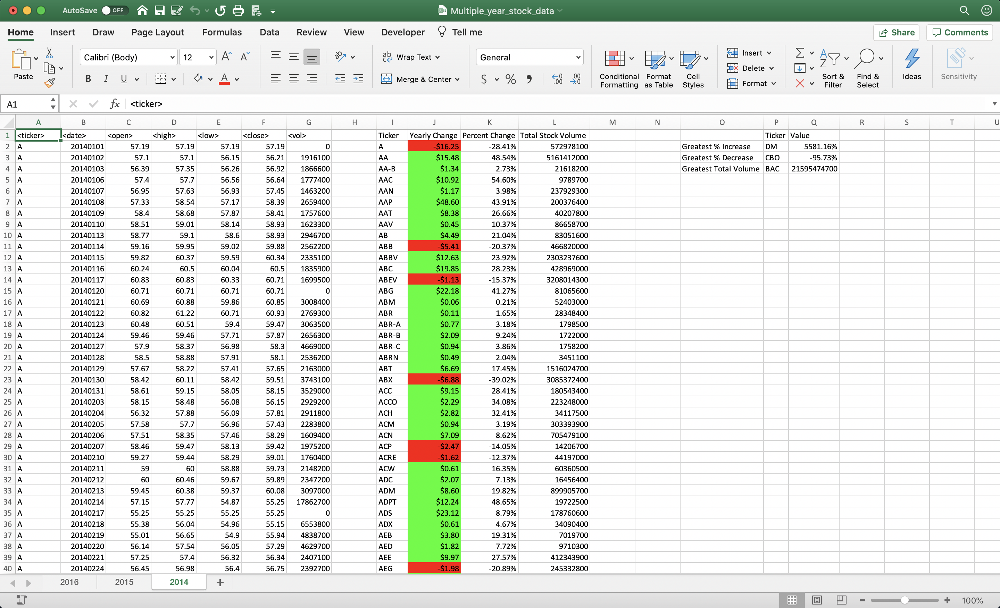

# VBA-challenge: The VBA of Wall Street

## Base Homework

This VBA script analyses annual stock market data and does the following:
* Outputs a summary table with the unique ticker symbol, yearly change, percent change and total stock volume of the ticker
* The Yearly Change field will be highlighted in green if it was a positive change, or red for a negative change

All challenges have been completed in the SummarizeStocks.vbs file

Notes to consider:
* It is assumed that the data is sorted by the ticker symbol in alphabetical order, followed by the date in chronological order. 

* While testing on the file alphabetical_testing.xlsm, it was observed that all the values for the ticker with symbol PLNT are zero, thus giving an error while calculating percent change (division by zero). An if statement was added to check division by zero and when percent change is being calculated, a message box will now pop up identifying the ticker and row with the zero value. Then a value of zero is assumed for percent change to avoid it copying the previous percent change value and will be displayed as such on the summary table.

* In the file Multiple_year_stock_data.xlsm however, the PLNT ticker has its first opening price on 6 August 2015. Any values before this date are zero and follows the same as above (see 2014 summary table on Multiple_year_stock_data.xlsm)

* Percentages have been formatted as 0.00% and Yearly Change as $#,##0.00

## Challenge 1

Challenge 1 is a second summary table that would display the greatest % increase, the greatest % decrease and the greatest stock volume from the previous summary table. These values are calculated by comparing percent changes in each row of the previous summary table, as well as total volume.

## Challenge 2

Challenge 2 is to run the VBA script on all worksheets in one go. This was done by defining the worksheet variable as ws, and then running a for loop to go through each worksheet. All local objects are called with "ws." followed by the worksheet object

## Screenshots of each year's summary

### 2016 

### 2015

### 2014

